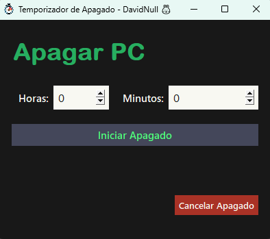

# Turn-Off Timer

Temporizador para apagar tu PC automáticamente :)

```bash
1. Ejecuta el archivo .exe
2. Elige horas/minutos y pulsa 'Iniciar Apagado'
3. Cancela si es necesario 
```
## Preview
<div align="center">
  
</div>

Autor: David Null 🐰
<br><br><br>
